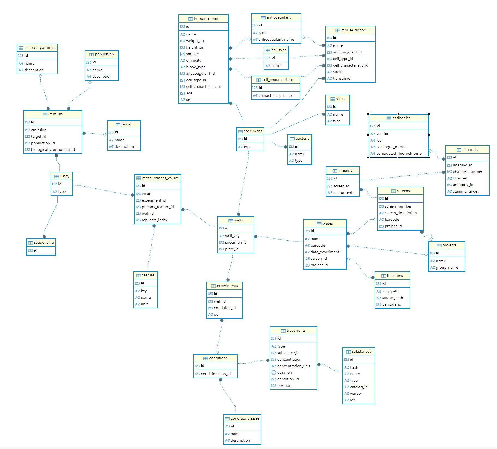
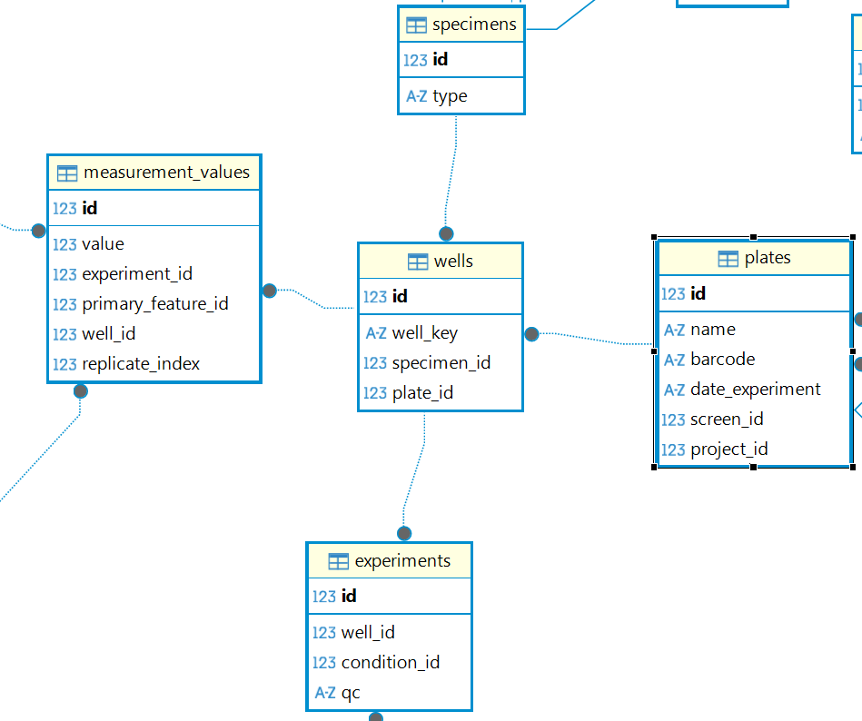
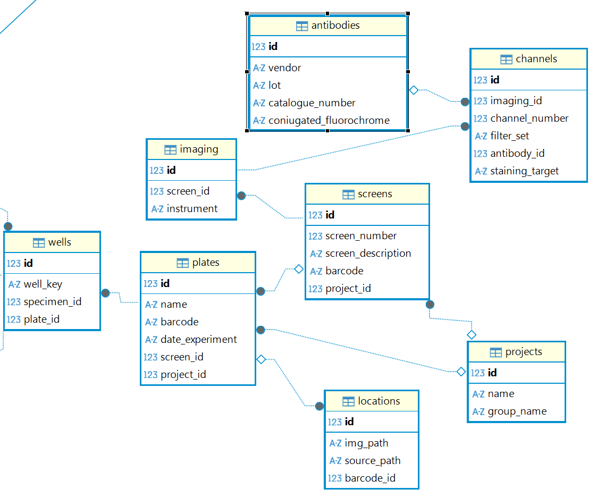
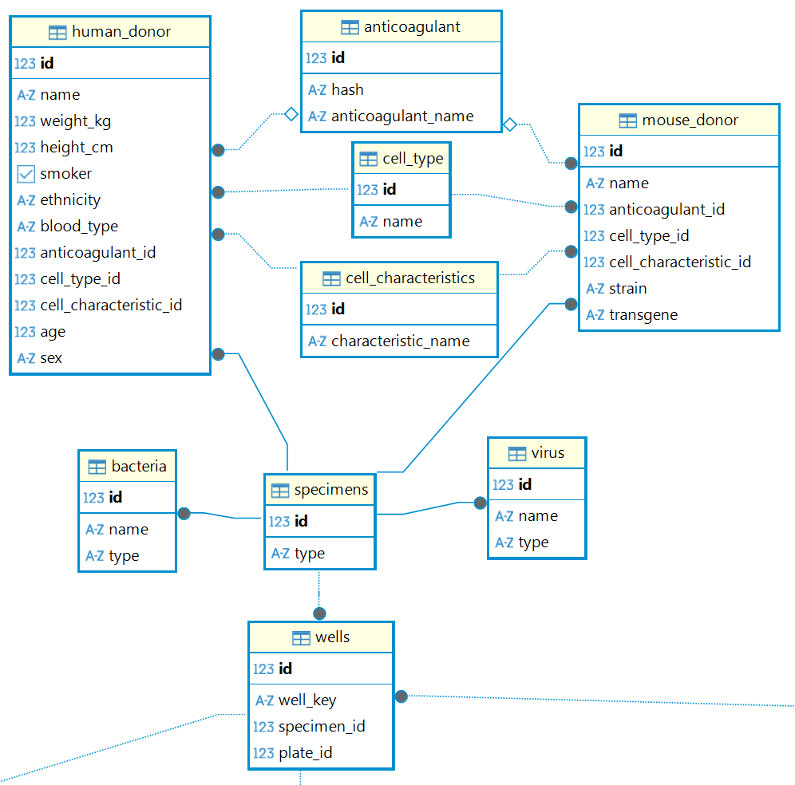
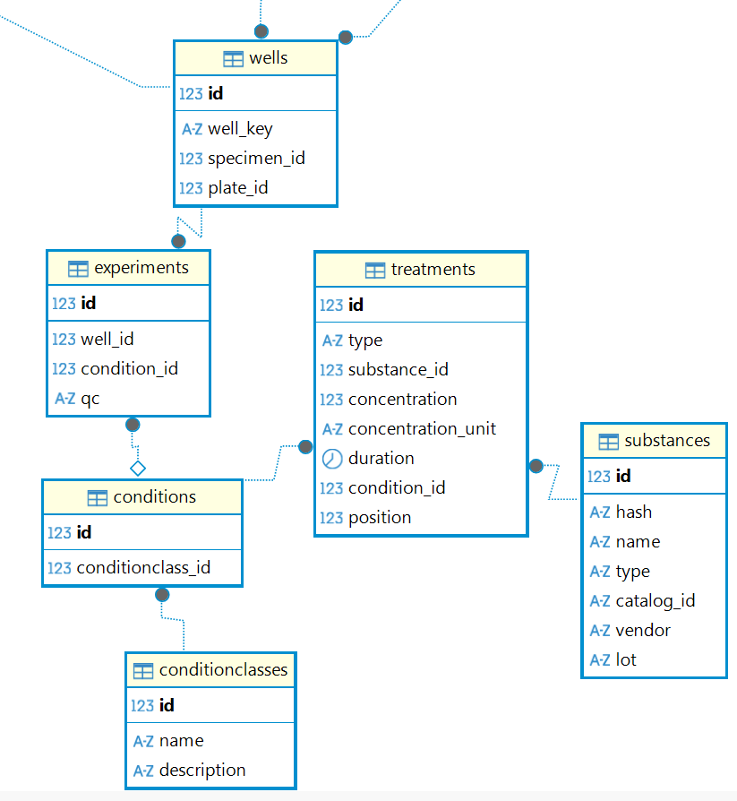
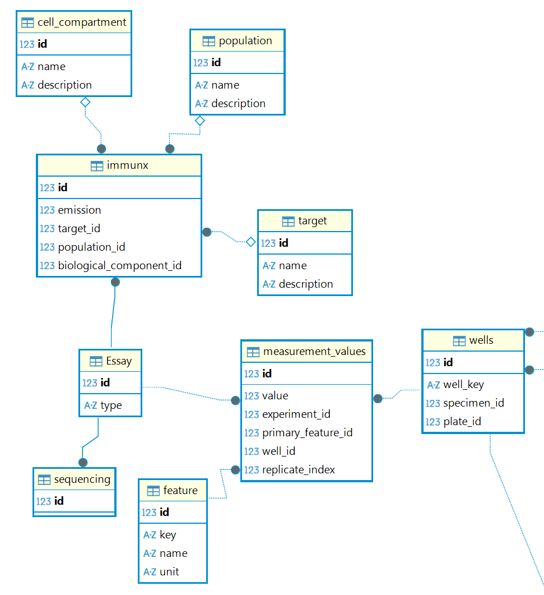

# Database Model Guide

## 1. Introduction

### Goal of this database
The goal of this database is to provide a **centralized data collection system** for experiments generated by the LAT facility (Automation Core Facility).

In practice, this means:
- Storing experiment data in one consistent structure.
- Connecting metadata (project, screen, plate, specimen, treatment, measurements) to each experimental unit.
- Making data traceable, queryable, and reproducible across many runs.

This guide explains the model from practical concepts first, then technical details.

---

## 2. Wells table

The `wells` table is the center of the data model.

Why it is central:
- A well is the physical experimental unit on a plate.
- From `wells`, there are 4 linked branches (management, specimen, experiment, and measurement).

Think of one row in `wells` as:
"One position on one plate, containing one specimen, producing one experiment state and many measurements."

#### Columns
- `id`: Internal unique identifier of the well record.
- `well_key`: The physical position label on the plate (`A01`, `H08`, `P24`).
- `specimen_id`: Which specimen is in that well.
- `plate_id`: Which plate this well belongs to.
- `experiment_id`: Optional linked experiment state for that well.

#### Constraints
- A well must belong to a plate (`plate_id` cannot be empty).
- A well must have a specimen (`specimen_id` cannot be empty).
- You cannot store the same well position twice in the same plate.
	- Example: Plate 55 cannot have two `A01` rows.
	- But plate 55 can have `A01`, and plate 56 can also have `A01`.

---

### 2.1. Wells table technical view

#### ORM definition summary
The model enforces:
- `well_key` as `String(3)` and `nullable=False`
- `specimen_id` as `ForeignKey(specimens.id)` and `nullable=False`
- `plate_id` as `ForeignKey(plates.id)` and `nullable=False`
- `experiment_id` as `ForeignKey(experiments.id)` and `unique=True`
- `UniqueConstraint(plate_id, well_key)`
- Indexes on `plate_id` and `specimen_id`

#### Relationship summary
- `plate`: many wells -> one plate (`Well.plate`)
- `specimen`: many wells -> one specimen (`Well.specimen`)
- `experiment`: one well -> at most one experiment state (`Well.experiment`, `uselist=False`)
- `measurements`: one well -> many measurement records (`Well.measurements`)

#### Why these constraints matter
- `UniqueConstraint(plate_id, well_key)` protects plate geometry integrity. In a real plate, one coordinate can exist only once.
- Non-null FKs protect semantic integrity: A well without plate or specimen is not meaningful in this system.

---

## 3. Management branch (`management.py`)

The management branch is the part of the database that handles data ownership and administration.

In simple words, it answers questions like:
- Which project does this data belong to?
- Which screen and plate generated this data?
- Where are the source and image files stored?
- Which imaging setup, channels, and antibodies are associated with a screen?

Why this branch matters
- Guarantees data ownership traceability from every well back to project/screen.
- Supports administration workflows (who owns which data, where it came from).
- Improves reproducibility by retaining plate-level source and image paths.
- Captures imaging metadata in a normalized way (instrument -> channels -> antibody details).

Connection to the core (`wells`):
- `wells` is linked to `plates` through `wells.plate_id` -> `plates.id`.
- Because `plates` links to `screens` and `projects`, each well can be traced back to its full administrative context.

Hierarchy and cardinality:
- **One project can have MANY screens** (one-to-many).
- **One screen can have MANY plates** (one-to-many).
- **One screen can have MANY imaging setups** (one-to-many).
- **One imaging setup can have MANY channels** (one-to-many).
- **One antibody can be referenced by MANY channels** (one-to-many).
- Each plate belongs to exactly one screen (many-to-one).
- Each screen belongs to exactly one project (many-to-one).
- Each plate also directly references its project for easier querying.
- Each plate can have MANY wells (one-to-many).

Flow of ownership:
- `1 Project` -> `many Screens` -> `many Plates` -> `many Wells`
- Each `Plate` -> optionally `many Locations` (file source/image)
- Each `Screen` -> optionally `many Imaging` -> `many Channels` (optionally linked to antibodies)

---

### 3.1. Management tables 

#### 3.1.1 `projects`
One row represents one top-level study/program in LAT.

**Cardinality**: One project -> many screens, many plates.

Columns:
- `id`: Internal ID.
- `name`: Human-readable project name.
- `group_name`: Import-facing project/group key.

Constraints:
- `name` is unique.
- `group_name` is unique.

#### 3.1.2 `screens`
One row represents one screen inside one project.

**Cardinality**: One screen -> many plates. Each screen belongs to exactly one project.

Columns:
- `id`: Internal ID.
- `screen_number`: Numeric screen identifier.
- `screen_description`: Optional text description.
- `project_id`: Which project this screen belongs to.

Constraints:
- A screen number must be unique only inside its project.
	- Same `screen_number` can exist in another project.
	- Same `screen_number` cannot repeat in the same project.

#### 3.1.3 `plates`
One row represents one physical/experimental plate.

Barcode policy:
- A barcode defines a physical plate.
- Plate barcode is unique in the database.
- If an experiment on a plate is repeated, the new plate run must use a new barcode.

Barcode components:
- Project acronym: 3 uppercase letters (example: `IMX` for `immunx_meta`).
- Project number: `PR` + 2 digits (example: `PR01`).
- Sprint number: `S` + 2 digits (example: `S04`).
- Run number: `R` + 2 digits (example: `R01`).
- Plate number: lowercase `p` + 2 digits (example: `p06`).
- Full example: `IMXPR01S04R01p06`.

**Cardinality**: One plate -> many wells, many locations. Each plate belongs to exactly one screen and one project.

Columns:
- `id`: Internal ID.
- `name`: Plate name.
- `barcode`: Required unique physical-plate barcode.
- `date_experiment`: Experiment date from source data.
- `screen_id`: Which screen generated this plate.
- `project_id`: Which project this plate belongs to.

Constraints:
- `name` is required (`nullable=False`).
- `barcode` is required and unique.
- Barcode format: `<AAA>PR##S##R##p##`.
	- Example: `IMXPR01S04R01p06`.
	- If an experiment is repeated, a new barcode must be generated for the new physical plate.

Consistency check script:
- Use `check_barcode_consistency.py` to validate barcode format in a single value or across a CSV column.

#### 3.1.4 `locations`
One row stores file-system metadata for one plate.

Columns:
- `id`: Internal ID.
- `img_path`: Path to image folder/file.
- `source_path`: Path to source input file.
- `barcode_id`: Which plate this location record belongs to.

Constraints:
- `img_path` is required (`nullable=False`).

#### 3.1.5 `imaging`
One row stores one imaging setup attached to a screen.

**Cardinality**: One screen -> many imaging setups.

Columns:
- `id`: Internal ID.
- `screen_id`: Which screen this imaging setup belongs to.
- `instrument`: Imaging instrument used for acquisition.

Constraints:
- `screen_id` is required (`nullable=False`).
- `instrument` is required (`nullable=False`).

#### 3.1.6 `antibodies`
Reference table for antibody metadata used by channels.

**Cardinality**: One antibody -> many channels.

Columns:
- `id`: Internal ID.
- `vendor`: Antibody vendor. Required.
- `lot`: Lot identifier (optional).
- `catalogue_number`: Vendor catalog number (optional).
- `coniugated_fluorochrome`: Conjugated fluorochrome label (optional).

Constraints:
- `vendor` is required (`nullable=False`).

#### 3.1.7 `channels`
One row stores one acquisition channel definition for a given imaging setup.

**Cardinality**: One imaging setup -> many channels. Each channel belongs to one imaging setup. A channel can optionally reference one antibody.

Columns:
- `id`: Internal ID.
- `imaging_id`: Which imaging setup this channel belongs to.
- `channel_number`: Ordered channel number inside one imaging setup.
- `filter_set`: Filter set metadata (optional).
- `antibody_id`: Optional antibody reference.
- `staining_target`: Staining target label (optional).

Constraints:
- `imaging_id` is required (`nullable=False`).
- `channel_number` is required (`nullable=False`).
- Unique per imaging setup: `UniqueConstraint(imaging_id, channel_number)`.

---

### 3.2. Management branch technical view

#### 3.2.1 Relationship map
- `Project.screens`: one-to-many
- `Project.plates`: one-to-many
- `Screen.project`: many-to-one
- `Screen.plates`: one-to-many
- `Plate.screen`: many-to-one
- `Plate.project`: many-to-one
- `Plate.wells`: one-to-many
- `Plate.locations`: one-to-many
- `Location.plate`: many-to-one
- `Screen.imagings`: one-to-many
- `Imaging.screen`: many-to-one
- `Imaging.channels`: one-to-many
- `Channel.imaging`: many-to-one
- `Antibody.channels`: one-to-many
- `Channel.antibody`: many-to-one (optional)

#### 3.2.2 Table-by-table technical summary

#### `projects`
- PK: `id`
- Columns:
	- `name = Column(String, unique=True)`
	- `group_name = Column(String, unique=True)`
- Notes:
	- Both fields are unique identifiers used for ownership and import consistency.

#### `screens`
- PK: `id`
- Columns:
	- `screen_number = Column(Integer, nullable=False)`
	- `screen_description = Column(String)`
	- `project_id = Column(Integer, ForeignKey('projects.id'))`
- Constraint:
	- `UniqueConstraint('screen_number', 'project_id', name='uq_screen_number_project')`

#### `plates`
- PK: `id`
- Columns:
	- `name = Column(String, nullable=False)`
	- `barcode = Column(String, nullable=False)`
	- `date_experiment = Column(String)`
	- `screen_id = Column(Integer, ForeignKey('screens.id'))`
	- `project_id = Column(Integer, ForeignKey('projects.id'))`
- Constraints:
	- `UniqueConstraint('barcode', name='uq_plate_barcode')`
	- `CheckConstraint("barcode ~ '^[A-Z]{3}PR[0-9]{2}S[0-9]{2}R[0-9]{2}p[0-9]{2}$'", name='ck_plate_barcode_format')`
- Notes:
	- This table is the bridge between the administrative hierarchy and the core well-level data.

#### `locations`
- PK: `id`
- Columns:
	- `img_path = Column(String, nullable=False)`
	- `source_path = Column(String)`
	- `barcode_id = Column(Integer, ForeignKey('plates.id'))`
- Notes:
	- Stores external file locations tied to plate-level data provenance.

#### `imaging`
- PK: `id`
- Columns:
	- `screen_id = Column(Integer, ForeignKey('screens.id'), nullable=False)`
	- `instrument = Column(String, nullable=False)`
- Notes:
	- Stores the acquisition setup for a screen.

#### `antibodies`
- PK: `id`
- Columns:
	- `vendor = Column(String, nullable=False)`
	- `lot = Column(String, nullable=True)`
	- `catalogue_number = Column(String, nullable=True)`
	- `coniugated_fluorochrome = Column(String, nullable=True)`
- Notes:
	- Reusable antibody reference metadata linked by channels.

#### `channels`
- PK: `id`
- Columns:
	- `imaging_id = Column(Integer, ForeignKey('imaging.id'), nullable=False)`
	- `channel_number = Column(Integer, nullable=False)`
	- `filter_set = Column(String, nullable=True)`
	- `antibody_id = Column(Integer, ForeignKey('antibodies.id'), nullable=True)`
	- `staining_target = Column(String, nullable=True)`
- Constraint:
	- `UniqueConstraint('imaging_id', 'channel_number', name='uq_channel_per_imaging')`

---

## 4. Specimen branch (`specimen.py`)

The specimen branch describes the biological material loaded into each well.

In simple words, it answers:
- What was in that well? A human donor, a mouse donor, a virus, or bacteria?
- What are the biological and clinical properties of the donor?
- Which anticoagulant, cell type, and cell characterisation were used?

Why this branch matters
- Captures full biological provenance of each well: who/what was the specimen.
- Joined-table inheritance avoids a single wide table with many nullable columns.
- The anticoagulant partial unique index prevents hash collisions for known compounds while
  gracefully handling cases where the anticoagulant is not in PubChem.

Connection to the core (`wells`):
- `wells.specimen_id` -> `specimens.id`.
- Every well is linked to exactly one specimen; one specimen can appear in many wells.

Hierarchy and cardinality:
- **One specimen can be placed in MANY wells** (same donor, different plates or positions).
- **One Anticoagulant can be used with MANY HumanDonors and MANY MouseDonors**.
- `CellType` and `CellCharacteristics` are lookup tables; one entry is referenced by many donors.

Inheritance design:
- All specimen types share the `specimens` base table (common ID and discriminator `type` column).
- Each subtype extends it with its own table: `human_donor`, `mouse_donor`, `virus`, `bacteria`.
- This is called **joined-table inheritance**: querying a HumanDonor joins `specimens` + `human_donor`.

#### Requirements:
For this branch to function correctly, the `pubchem_data.json` file is required.

---

### 4.1 Specimen tables 

#### 4.1.1 `specimens` (base table)
Every specimen of any type has exactly one row here.

Columns:
- `id`: Internal ID, shared across all subtypes via a common sequence.
- `type`: Tells the system which subtype this row belongs to (`human`, `mouse`, `virus`, `bacteria`).

#### 4.1.2 `human_donor`
Extends `specimens` with human-donor–specific clinical properties.

**Cardinality**: One human donor -> many wells. Belongs to one Anticoagulant, one CellType, one CellCharacteristics.

Columns:
- `id`: FK to specimens.id (primary key).
- `name`: Donor identifier. Required.
- `weight_kg`, `height_cm`: Physical measurements.
- `smoker`: Boolean flag.
- `ethnicity`: Donor ethnicity.
- `blood_type`: ABO/Rh blood type (e.g. `A+`, `O-`).
- `anticoagulant_id`: FK to anticoagulant table.
- `cell_type_id`: FK to cell_type table. Required.
- `cell_characteristic_id`: FK to cell_characteristics table. Required.
- `age`: Donor age.
- `sex`: Biological sex (`M` or `F`).

#### 4.1.3 `mouse_donor`
Extends `specimens` with mouse-donor–specific properties.

**Cardinality**: One mouse donor -> many wells. Belongs to one Anticoagulant, one CellType, one CellCharacteristics.

Columns:
- `id`: FK to specimens.id (primary key).
- `name`: Mouse identifier. Required.
- `anticoagulant_id`: FK to anticoagulant table.
- `cell_type_id`: FK to cell_type table. Required.
- `cell_characteristic_id`: FK to cell_characteristics table. Required.
- `strain`: Mouse strain (e.g. `C57BL/6`).
- `transgene`: Transgene information if applicable.

#### 4.1.4 `virus`
Extends `specimens` for viral agents used in infection or stimulation.

Columns:
- `id`: FK to specimens.id (primary key).
- `name`: Virus name. Required.
- `category_type` (DB column: `type`): Genome type. Values: `DNA`, `RNA`.

#### 4.1.5 `bacteria`
Extends `specimens` for bacterial agents used in infection or stimulation.

Columns:
- `id`: FK to specimens.id (primary key).
- `name`: Bacteria name. Required.
- `category_type` (DB column: `type`): Gram stain type. Values: `gram+`, `gram-`.

#### 4.1.6 `anticoagulant`
Reference table for the anticoagulant used during blood collection.

**Cardinality**: One anticoagulant -> many human donors, many mouse donors.

Columns:
- `id`: Internal ID.
- `hash`: PubChem SHA-256 hash (first 8 chars) for known compounds. Set to `non available` for unknowns.
- `anticoagulant_name`: Name of the anticoagulant. Required.

Constraints:
- Partial unique index on `hash`: unique only when hash is NOT `non available`.
  This allows multiple distinct unknown anticoagulants to coexist without collapsing into one record.

#### 4.1.7 `cell_type`
Lookup table for cell types.

Columns:
- `id`: Internal ID.
- `name`: Cell type name. Required and unique. Examples: `PBMC`, `liver`, `neurons`. Other cell types can be added.

#### 4.1.8 `cell_characteristics`
Lookup table for cell characterisation markers.

Columns:
- `id`: Internal ID.
- `name` (DB column: `characteristic_name`): Marker label. Required and unique. Examples: `primary`...

---

### 4.2. Specimen branch technical view

#### 4.2.1 Relationship map
- `Specimen.wells`: one-to-many (one specimen -> many wells)
- `HumanDonor.anticoagulant`: many-to-one
- `HumanDonor.cell_type`: many-to-one
- `HumanDonor.cell_characteristic`: many-to-one
- `MouseDonor.anticoagulant`: many-to-one
- `MouseDonor.cell_type`: many-to-one
- `MouseDonor.cell_characteristic`: many-to-one
- `Anticoagulant.human_donors`: one-to-many
- `Anticoagulant.mouse_donors`: one-to-many

#### 4.2.2 Table-by-table technical summary

#### `specimens`
- PK: `id` (from `specimen_id_seq` shared sequence)
- `type = Column(String(50), nullable=False)` — polymorphic discriminator

#### `human_donor`
- PK: `id = Column(Integer, ForeignKey("specimens.id"))`
- Required FKs: `cell_type_id`, `cell_characteristic_id`
- Optional FK: `anticoagulant_id`
- `polymorphic_identity`: `'human'`

#### `mouse_donor`
- PK: `id = Column(Integer, ForeignKey("specimens.id"))`
- Required FKs: `cell_type_id`, `cell_characteristic_id`
- Optional FK: `anticoagulant_id`
- `polymorphic_identity`: `'mouse'`

#### `virus`
- PK: `id = Column(Integer, ForeignKey("specimens.id"))`
- `category_type` stored as DB column `type`
- `polymorphic_identity`: `'virus'`

#### `bacteria`
- PK: `id = Column(Integer, ForeignKey("specimens.id"))`
- `category_type` stored as DB column `type`
- `polymorphic_identity`: `'bacteria'`

#### `anticoagulant`
- PK: `id`
- `hash = Column(String(64), nullable=False)`
- `anticoagulant_name = Column(String(100), nullable=False)`
- Partial unique index: `WHERE hash <> 'non available'`

#### `cell_type`
- PK: `id`
- `name = Column(String(50), nullable=False, unique=True)`

#### `cell_characteristics`
- PK: `id`
- `name = Column("characteristic_name", String(100), nullable=False, unique=True)`

---

## 5. Experiment branch (`experiment.py`)

The experiment branch captures the intervention logic applied to wells and the resulting experiment state.

In simple words, it answers:
- Which substances were used?
- In what order were treatments applied?
- Which condition was assigned to each well?
- What is the QC state for that well experiment?

Why this branch matters
- Encodes intervention logic in a reproducible structure (substance, dose, unit, duration, order).
- Separates condition definition from per-well assignment, improving reuse and consistency.
- Enforces one experiment record per well while allowing a condition to be reused across many wells.

Connection to the core (`wells`):
- `wells.experiment_id` -> `experiments.id`.
- This link is unique, so one well has at most one linked experiment row.

Hierarchy and cardinality:
- **One substance can appear in MANY treatments**.
- **One condition class can contain MANY conditions**.
- **One condition can contain MANY treatments** (ordered by position).
- **One condition can be linked to MANY experiments**.
- **One well can have at most ONE experiment**.

Flow:
- `Substance` -> `Treatment` -> `Condition` -> `Experiment` -> `Well`
- `ConditionClass` groups multiple `Condition` rows for easier query and organization.

#### Requirements:
For this branch to function correctly, the `pubchem_data.json` file is required.

---

### 5.1 Experiment tables 

#### 5.1.1 `substances`
Chemical reference table for compounds used in treatments.

Columns:
- `id`: Internal ID.
- `hash`: Unique hash identifier for the compound. Required.
- `name`: Substance name. Required.
- `type`: Substance category/type. Required.
- `catalog_id`: Vendor catalog identifier. Required.
- `vendor`: Vendor name. Required.
- `lot`: Lot identifier. Required.

Constraints:
- `hash` is unique.

#### 5.1.2 `conditionclasses`
Grouping table used to organize families of related conditions.

Columns:
- `id`: Internal ID.
- `name`: Condition class name.
- `description`: Human-readable description.

Recommended condition class values:
- `naive`
- `prim`
- `prim_activ`
- `activ`

#### 5.1.3 `conditions`
Represents one condition, which is an ordered sequence of treatment steps.

Columns:
- `id`: Internal ID.
- `conditionclass_id`: Which condition class this condition belongs to.

**Cardinality**: One condition class -> many conditions. One condition -> many treatments.

#### 5.1.4 `treatments`
One treatment step inside a condition.

Columns:
- `id`: Internal ID.
- `type`: Treatment type/category.
- `substance_id`: Which substance is applied.
- `concentration`: Concentration value.
- `concentration_unit`: Unit for concentration.
- `duration`: Incubation duration.
- `condition_id`: Which condition this step belongs to.
- `position`: Order of this treatment step within the condition.

Constraints:
- Composite unique constraint on:
	`(type, substance_id, concentration, concentration_unit, duration, condition_id, position)`.
- Check constraint on `concentration_unit`:
	only allowed units are `mM`, `uM`, `nM`, `ugml`, `mgml`, `ngml`.

#### 5.1.5 `experiments`
Stores the experiment state for a specific well.

Columns:
- `id`: Internal ID.
- `condition_id`: Which condition is assigned (optional).
- `qc`: Quality-control status (`pass` by default).

Constraints:
- One experiment can be linked from at most one well through `wells.experiment_id`.

---

## 5.2. Experiment branch technical view

#### 5.2.1 Relationship map
- `Substance.treatments`: one-to-many
- `Treatment.substance`: many-to-one
- `ConditionClass.conditions`: one-to-many
- `Condition.conditionclass`: many-to-one
- `Condition.treatments`: one-to-many (ordered by `position`)
- `Treatment.condition`: many-to-one
- `Condition.experiments`: one-to-many
- `Experiment.condition`: many-to-one
- `Experiment.well`: one-to-one (`uselist=False`, linked via `wells.experiment_id`)

#### 5.2.2 Table-by-table technical summary

#### `substances`
- PK: `id`
- `hash = Column(String(64), unique=True, nullable=False)`
- Required metadata columns: `name`, `type`, `catalog_id`, `vendor`, `lot`

#### `conditionclasses`
- PK: `id`
- `name = Column(String(30), nullable=False)`
- `description = Column(String, nullable=False)`

#### `conditions`
- PK: `id`
- `conditionclass_id = Column(Integer, ForeignKey('conditionclasses.id'), nullable=False)`

#### `treatments`
- PK: `id`
- FKs:
	- `substance_id -> substances.id` (required)
	- `condition_id -> conditions.id` (required)
- Ordering field:
	- `position = Column(Integer, nullable=False)`
- Constraints:
	- composite unique constraint on treatment signature + order within condition
	- check constraint `concentration_unit` in allowed set

#### `experiments`
- PK: `id`
- `condition_id = Column(Integer, ForeignKey('conditions.id'))` (optional)
- `qc = Column(String(4), nullable=False, default='pass')`
- Linked from wells through:
	- `wells.experiment_id = Column(Integer, ForeignKey('experiments.id'), unique=True)`

---

## 6. Measurement branch (`measurement.py`)

The measurement branch stores quantitative outputs produced for each well and links them to a typed measurement experiment.

In simple words, it answers:
- Which numeric values were measured for one well?
- Which feature/key does each value represent?
- Which type of measurement experiment produced the value (IMMUNX, sequencing, future types)?

Why this branch matters
- Normalizes measured features in one dictionary table, avoiding repeated free-text feature names.
- Stores all numeric facts in a single scalable table (`measurement_values`).
- Uses the `essay` base table (polymorphic) to keep the schema flexible:
	new measurement experiment types can be added without redesigning existing measurement storage.

Connection to the core (`wells`):
- `measurement_values.well_id` -> `wells.id`.
- One well can have many measurement rows.

Hierarchy and cardinality:
- **One essay experiment can have MANY measurement values**.
- **One well can have MANY measurement values**.
- **One primary feature can be referenced by MANY measurement values**.
- **One IMMUNX experiment can reference one target, one population, and one cell compartment**.

Flow:
- `essay` (typed experiment) -> `MeasurementValue` <- `Well`
- `PrimaryFeature` defines what is measured (feature key/name/unit)
- `IMMUNX` extends `essay` with domain metadata (`target`, `population`, `cell_compartment`)

---

### 6.1 Measurement tables

#### 6.1.1 `essay`
Polymorphic base table for measurement experiment types.

Columns:
- `id`: Internal ID.
- `type`: Experiment discriminator (e.g., `immunx`, `sequencing`, future values).

Why this table is important:
- It makes the schema extensible. New measurement modalities can be added as child tables
	without changing the core `measurement_values` fact table.

#### 6.1.2 `immunx`
Specialized subtype of `essay` for IMMUNX measurements.

Columns:
- `id`: FK to `essay.id` (primary key).
- `emission`: Emission value.
- `target_id`: Optional FK to `target`.
- `population_id`: Optional FK to `population`.
- `cell_compartment_id`: Optional FK to `cell_compartment`.

#### 6.1.3 `sequencing`
Specialized subtype of `essay` for sequencing measurements.

Columns:
- `id`: FK to `essay.id` (primary key).

#### 6.1.4 `target`
Definition: what biomarker/signal/antibody is being measured(examples: IL1b, TNFa, Speck). Interpretation: this is the primary analyte of the readout, usually linked to the antibody specificity.
Typical cardinality: one target can be reused by many IMMUNX assay definitions.

Columns:
- `id`: Internal ID.
- `name`: Target label. Required.
- `description`: Optional description.

#### 6.1.5 `population`
Definition: optional gating/conditioning population used to subset the measured events/cells (examples: TNFa-positive cells, IL1b-positive cells, Speck_multi cells). Interpretation: it does not replace target; it adds a selection condition over which the target is measured.
Typical cardinality: optional; nullable relation because some measurements are ungated/global.

Columns:
- `id`: Internal ID.
- `name`: Population label. Required.
- `description`: Optional description.

#### 6.1.6 `cell_compartment`
Definition: where the signal is measured (spatial/biological compartment, examples: nucleus, cytoplasm, whole cell, supernatant). Interpretation: it gives location context to the target measurement.
Typical cardinality: one compartment can be reused by many IMMUNX assay definitions.

Columns:
- `id`: Internal ID.
- `name`: Cell compartment label. Required.
- `description`: Optional description.

#### 6.1.7 `feature`
A feature is the quantitative property extracted from an assay signal for a given assay context (essay, target, population, and cell compartment). It describes what is measured numerically, such as count, area, mean intensity, percent, or ratio.

Examples of features:
Count: total number of detected objects (for example number of specks, number of cells).
Area: size-related measurement (for example mean area, total area).
Intensity: signal strength (for example mean fluorescence intensity).
Percent: fraction of positives within a reference set.
Ratio: relationship between two signals/identities (for example IL1b/TNFa ratio, delta ratio).
...

Columns:
- `id`: Internal ID.
- `key`: Stable short key for the feature. Required.
- `name`: Human-readable feature name. Required.
- `unit`: Optional measurement unit.

Constraints:
- `key` is unique (`uq_primary_feature_key`).

#### 6.1.8 `measurement_values`
The measurement_values table stores the actual numeric results of the assay, one row per measurement.
- `value` is the measured number (for example the actual value of count, area, intensity, ratio, percent).
- `essay_id` links to the assay context (which assay configuration produced the value).
- `feature_id` links to the feature definition (what quantity was measured and its unit, area or intensity...).
- `well_id` links the measurement to the specific experimental well.
- `replicate_index` distinguishes repeated or time-lapse observations (for example t0, t1, t2).
Together, these fields make each measurement traceable, structured, and scalable.

Columns:
- `id`: Internal ID.
- `value`: Numeric measurement value. Required.
- `essay_id`: FK to `essay.id`. Required.
- `feature_id`: FK to `feature.id`. Required.
- `well_id`: FK to `wells.id`. Required.
- `replicate_index`: Replicate identifier (default `0`). Required.

Constraints:
- Composite unique identity:
	`(well_id, essay_id, feature_id, replicate_index)`.

---

## 6.2. Measurement branch technical view

#### 6.2.1 Relationship map
- `essay.measurements`: one-to-many
- `MeasurementValue.experiment`: many-to-one
- `PrimaryFeature.measurements`: one-to-many
- `MeasurementValue.primary_feature`: many-to-one
- `Well.measurements`: one-to-many
- `MeasurementValue.well`: many-to-one
- `IMMUNX.target`: many-to-one
- `IMMUNX.population`: many-to-one
- `IMMUNX.cell_compartment`: many-to-one
- `Target.immunx_experiments`: one-to-many
- `Population.immunx_experiments`: one-to-many
- `CellCompartment.immunx_experiments`: one-to-many

#### 6.2.2 Table-by-table technical summary

#### `essay`
- PK: `id`
- `type = Column(String(50), nullable=False)`
- Polymorphic base (`polymorphic_on=type`)

#### `immunx`
- PK/FK: `id = Column(Integer, ForeignKey('essay.id'), primary_key=True)`
- Optional FKs:
	- `target_id -> target.id`
	- `population_id -> population.id`
	- `cell_compartment_id -> cell_compartment.id`
- `polymorphic_identity`: `'immunx'`

#### `sequencing`
- PK/FK: `id = Column(Integer, ForeignKey('essay.id'), primary_key=True)`
- `polymorphic_identity`: `'sequencing'`

#### `target`
- PK: `id`
- `name = Column(String(255), nullable=False)`
- `description = Column(String(1024), nullable=True)`

#### `population`
- PK: `id`
- `name = Column(String(255), nullable=False)`
- `description = Column(String(1024), nullable=True)`

#### `cell_compartment`
- PK: `id`
- `name = Column(String(255), nullable=False)`
- `description = Column(String(1024), nullable=True)`

#### `feature`
- PK: `id`
- `key = Column(String(100), nullable=False)`
- `name = Column(String(255), nullable=False)`
- `unit = Column(String(50), nullable=True)`
- Constraint:
	- `UniqueConstraint('key', name='uq_primary_feature_key')`

#### `measurement_values`
- PK: `id`
- Required FKs:
	- `essay_id = Column(Integer, ForeignKey('essay.id'), nullable=False)`
	- `feature_id = Column(Integer, ForeignKey('feature.id'), nullable=False)`
	- `well_id = Column(Integer, ForeignKey('wells.id'), nullable=False)`
- Required value fields:
	- `value = Column(Float, nullable=False)`
	- `replicate_index = Column(Integer, nullable=False, default=0)`
- Constraints/Indexes:
	- `UniqueConstraint('well_id', 'essay_id', 'feature_id', 'replicate_index', name='uq_measurement_value_identity')`
	- `Index('idx_measurement_value_feature_experiment', 'feature_id', 'essay_id')`
	- `Index('idx_measurement_value_well', 'well_id')`
	- `Index('idx_measurement_value_experiment', 'essay_id')`

---
